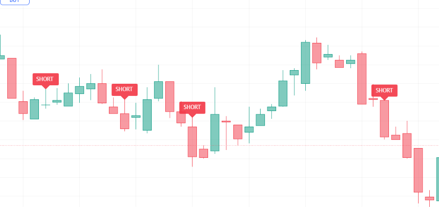

# Pine-Script-LS-Mixed-Indicator
Indicator based on higher-timeframe candle direction (30m), 3-minute HMA vs. EMA 30 trend alignment, 3-minute RSI momentum, 1-minute MACD zero-line filter, 3-minute MACD golden/dead crosses, and a fast Zone MACD signal crossover filter. Signals high-confluence Long and Short entry labels on TradingView.

--

## Chart Preview

--

## Motivation & Problem
- **False Breakouts in Counter-Trend Micro Swings**: Entering trades solely based on lower-timeframe oscillator crosses often leads to whipsaws when the trade opposes intermediate macro candle sentiment or lacks multi-tiered momentum support.
- **The Core Goal**: To design a strict composite filtering indicator that synchronizes 30-minute macro candle bias (bullish/bearish open-vs-close comparison), fast HMA vs. EMA 30 moving average direction, 3m RSI thresholds, dual-layer MACD confirmations (1m zero-line + 3m signal cross), and an auxiliary Zone MACD filter.

--

## Strategy Logic & Architecture
- This indicator avoids false signals and wrong interpretation of the trend by utilizing a **rule-based, multi-factor filtering system**:
### Core Components:
1. **Macro Trend & Moving Average Baseline (30m Candle & HMA/EMA 30)**:
  - Fetches 30-minute candle open and close prices via 'request.security()' to determine macro sentiment: bullish ('close30 > open30') or bearish ('close30 < open30').
  - Evaluates the 3-minute Hull Moving Average (HMA 9) against the 30-period EMA ('ema30_3') to ensure fast price velocity aligns with the medium-term trend direction.
2. **Dual-Timeframe MACD & Zone MACD Confluence**:
  - **1-Minute MACD Zero-Line Filter**: Checks 1-minute MACD line to confirm baseline momentum is above zero for longs or below zero for shorts.
  - **3-Minute MACD Signal Cross**: Detects live golden cross ('macd3_line' crossing above 'macd3_sig') for longs or dead cross for shorts.
  - **Zone MACD Filter**: Employs an additional fast MACD configuration (Fast 7, Slow 26, Signal 9) requiring the MACD line to remain above its signal line for longs and below for shorts.
3. **RSI Momentum Thresholds**:
  - Measures 3-minute RSI (length 7) to confirm sufficient momentum expansion, requiring RSI to be strictly above 52 for longs or below 42 for shorts.
4. **Execution Rules**:
  - **Long Signal (LONG)**: Triggers when all 6 conditions are simultaneously met:
    1. 30-minute candle is bullish ('close30 > open30').
    2. 3-minute HMA 9 is above 3-minute EMA 30 ('hma3 > ema30_3').
    3. 3-minute RSI is above 52 ('rsi3 > 52').
    4. 1-minute MACD line is above zero ('macd1_line > 0').
    5. 3-minute MACD prints a fresh golden cross ('macd3_golden_cross').
    6. Zone MACD line is above its signal line ('MACD_macd > MACD_signal').
    - Renders a prominent green "LONG" label above the candle.
  - **Short Signal (SHORT)**: Triggers when all 6 conditions are simultaneously met:
    1. 30-minute candle is bearish ('close30 < open30').
    2. 3-minute HMA 9 is below 3-minute EMA 30 ('hma3 < ema30_3').
    3. 3-minute RSI is below 42 ('rsi3 < 42').
    4. 1-minute MACD line is below zero ('macd1_line < 0').
    5. 3-minute MACD prints a fresh dead cross ('macd3_dead_cross').
    6. Zone MACD line is below its signal line ('MACD_macd < MACD_signal').
    - Renders a prominent red "SHORT" label above the candle.
      
--

## Configurable Parameters
Users can adjust the following parameters inside TradingView's settings panel:
- **HMA Length**: Default - 9. Lookback period for the fast Hull Moving Average on the 3m chart.
- **EMA Length**: Default - 30. Lookback period for the baseline Exponential Moving Average on the 3m chart.
- **RSI Length**: Default - 7. Lookback period for 3m RSI momentum confirmation.
- **MACD Settings**: Default - Fast EMA 12, Slow EMA 26, Signal Smoothing 9. Lookback periods for 1m and 3m standard MACD calculations.
- **Zone MACD Settings**: Default - Fast Length 7, Slow Length 26, Signal Smoothing 9. Customizable smoothing types (SMA/EMA) for auxiliary zone confirmation.

--

## How to Install & Use in TradingView
1. Open any crypto chart (e.g., `BTC/USDT`) on **[TradingView](https://www.tradingview.com/)**.
2. Open the **`Pine Editor`** console at the bottom of the page.
3. Open `LS-Mixed.txt` (or your Pine Script file), copy the source code, and paste it into the editor.
4. Click **`Save`** and then click **`Add to Chart`**.
5. Set your chart timeframe to **`3m`** and click the gear icon (`Settings`) on the indicator to adjust parameters as needed.

--

## Key Learnings & Engineering Reflections
1. **Macro Candle Open/Close Polarity as a Directional Anchor**
  - I learned that checking whether the higher-timeframe 30-minute bar is currently green or red ('close30 > open30') acts as a powerful directional filter, preventing long positions during macro bearish pressure and vice versa.
2. **Dual-Layer MACD Confluence (Zero-Line + Signal Cross)**
  - I learned that combining a lower-timeframe (1m) zero-line filter with an intermediate-timeframe (3m) signal cross ensures entries only fire when immediate momentum acceleration aligns with macro zero-line momentum.
3. **Hybrid Moving Average Pairs (HMA 9 vs. EMA 30)**
  - I learned that pairing an ultra-low-lag Hull Moving Average (HMA 9) against a smoothed EMA 30 provides earlier trend-reversal detection than traditional dual-EMA pairs without sacrificing signal stability.
